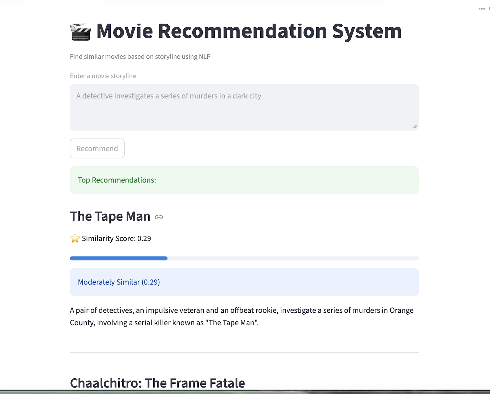

# imdb-movie-recommender

Overview

This project is a content-based movie recommendation system that suggests similar movies based on storyline input. It uses Natural Language Processing (NLP) techniques to analyze movie plots and recommend the most relevant movies.

The system is built using IMDb 2024 movie data scraped via Selenium and provides an interactive interface using Streamlit.

🚀 Features
🔍 Scrapes movie data (title + storyline) from IMDb
🧹 Cleans and preprocesses text using NLP techniques
🧠 Converts text into vectors using TF-IDF
📊 Computes similarity using Cosine Similarity
🎯 Recommends Top 5 similar movies
🌐 Interactive UI using Streamlit
⭐ Displays similarity scores with progress bars and labels

🛠 Tech Stack

Language

Python

Libraries & Tools

Selenium (Web Scraping)
Pandas (Data Processing)
Scikit-learn (TF-IDF, Cosine Similarity)
Streamlit (UI)
Regex (Text Cleaning)

📂 Project Structure
imdb-movie-recommender/
│
├── data/
│   ├── movies.csv
│   └── processed_movies.csv
│
├── scripts/
│   ├── scrape_imdb.py
│   ├── preprocess.py
│   └── recommend.py
│
├── app/
│   └── streamlit_app.py
│
├── requirements.txt
└── README.md

⚙️ Installation & Setup

1. Clone the Repository
git clone https://github.com/Monisha-12/imdb-movie-recommender.git
cd imdb-movie-recommender

2. Create Virtual Environment
python3 -m venv venv
source venv/bin/activate

3. Install Dependencies
pip install -r requirements.txt

▶️ How to Run
Step 1: Preprocess Data
python3 scripts/preprocess.py
Step 2: Run Streamlit App
streamlit run app/streamlit_app.py
Open browser:

http://localhost:8501

🧪 Example Input
A detective investigates a series of murders in a dark city

📊 Example Output
🎬 The Tape Man
⭐ Similarity Score: 0.29
📊 Visual similarity bar
🏷️ Moderately Similar
📖 Storyline displayed

🧠 How It Works
Data Collection
Scrapes IMDb movie data using Selenium
Data Preprocessing
Removes stopwords, punctuation, and noise
Cleans and tokenizes storyline text
Feature Extraction
Converts text into vectors using TF-IDF
Similarity Calculation
Uses Cosine Similarity to compare storylines
Recommendation Engine
Ranks movies and returns top matches
User Interface
Built using Streamlit for real-time interaction

## 📸 Demo

